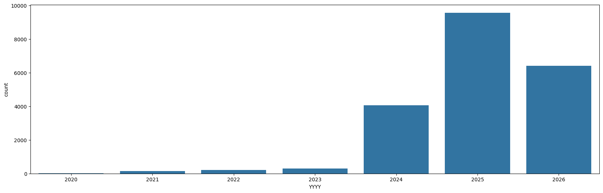
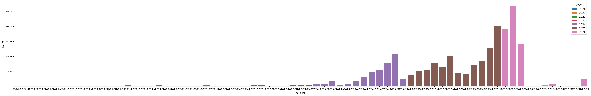

# Overview

Using ```data/raw/markets.parquet``` for market metadata and to figure out which markets are worth exploring (poltiical)
- Filterd for only closed events ```pl.col('closed') == 1```
- Applied political keyword filtering ```pl.any_horizontal([pl.col('question').str.to_lowercase().str.contains(kw) for kw in political_keywords])```
- Applied sports noise filtering which removed any additional sports events from the dataset. Used same logic as above with a different keyword set.
- Parsed ```outcome_prices``` col to determine whether the market resolved as ```{YES}``` or ```{NO}```. This produced a new column ```resolved_yes``` (bool) to highlight this.

**Dataset Shape:** ```(20689, 21)```

**Null Count:**
- ```resolved_yes``` - 2 null values


**Class Imblance:**
┌──────────────┬───────┐
│ resolved_yes ┆ count │
│ ---          ┆ ---   │
│ bool         ┆ u32   │
╞══════════════╪═══════╡
│ true         ┆ 5952  │
│ null         ┆ 2     │
│ false        ┆ 14735 │
└──────────────┴───────┘

**Ratio:** 0.288:0.712 ~ 30:70

**Date Range:** 4/11/2020 -> 31/12/2026

**Year Distribution:**



**Year-Month Distribution:**


